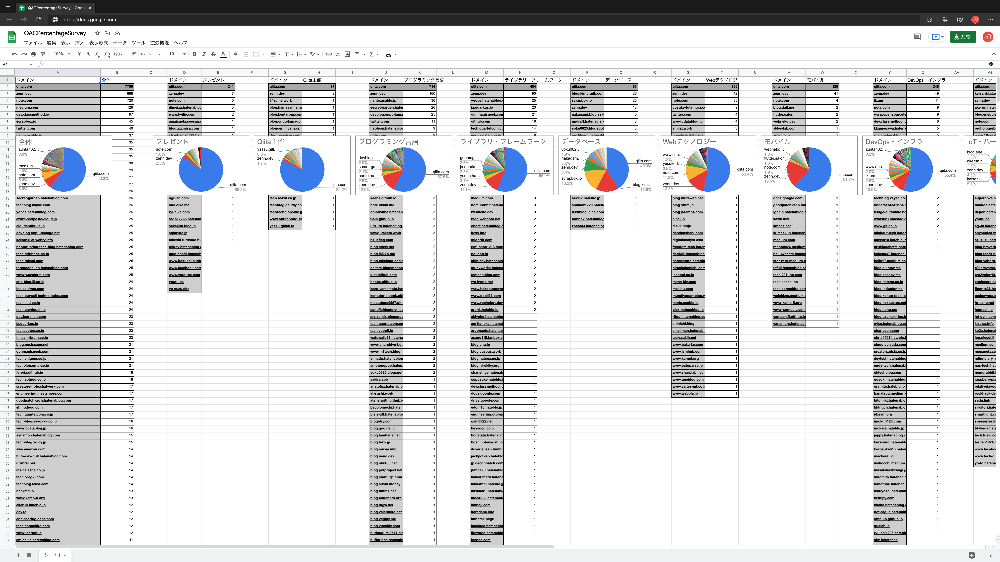

# QACPercentageSurvey

](https://docs.google.com/spreadsheets/d/1N7fR77n8m5CxkabtnPQnvgqi3zLyqqtL4yZ0rHvd8i4/edit?usp=sharing)

[Qiita Advent Calendar 2021 に登録された記事は Qiita公開 と Zenn公開 のどちらが多かったか？【Swift でスクレイピング】 https://qiita.com/treastrain/items/b9ca9503cc4c2dee42af](https://qiita.com/treastrain/items/b9ca9503cc4c2dee42af)

[Qiita Advent Calendar 2021](https://qiita.com/advent-calendar/2021) に登録されたカレンダーのメタ情報、記事の URL 等をまとめた JSON ファイルが「Outputs_<date>」内に出力されています。
上記 JSON ファイルを作成する際に使用した iOS・iPadOS および macOS Command Line で動作する Swift ファイルも同梱しています。Mac・iPad の Swift Playgrounds 4 および Mac の Xcode 13 系で開くことができます。
